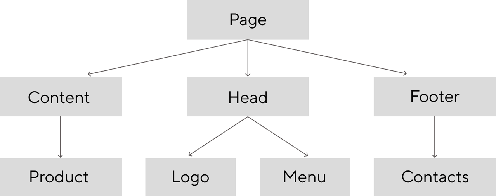
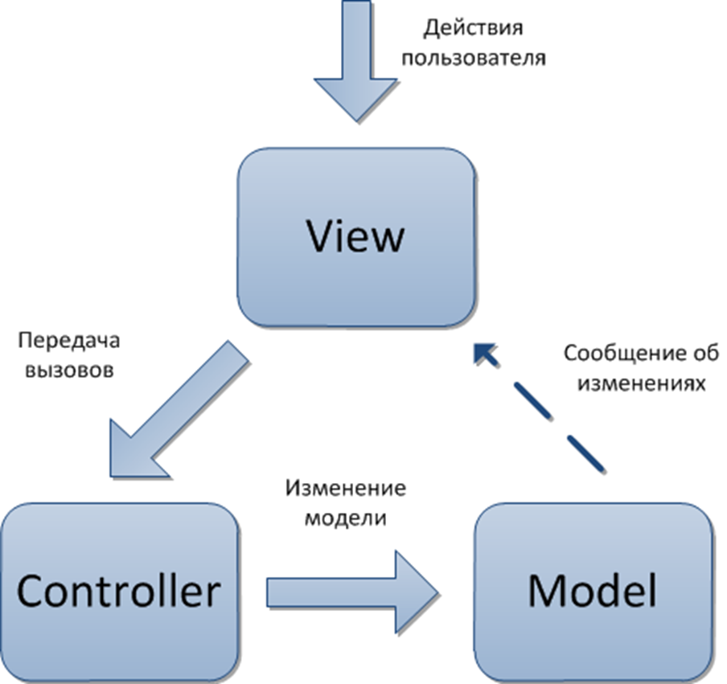
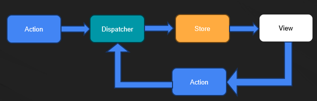
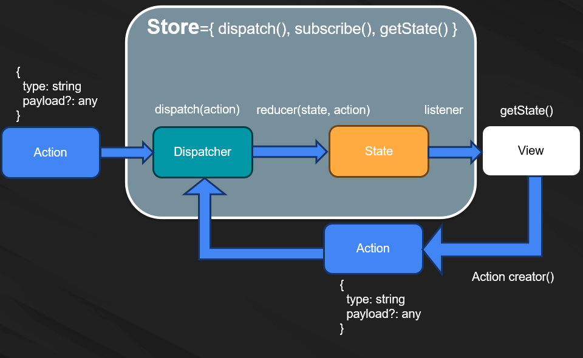

# Управление состоянием приложения, Redux и работа с actions

<!-- v -->

## Цели занятия

- Понять проблему управления состоянием и мотивацию централизованного стора
- Разобраться с принципами Redux (единственный источник правды, неизменяемость, чистые редьюсеры)
- Научиться проектировать `state`, `actions`, `reducers`, `store`
- Познакомиться с базовыми приёмами Redux Toolkit (слайсы, action creators, reducer'ы)

<!-- v -->

## Краткое содержание

- Состояние приложения и паттерны событийного взаимодействия (EventBus)
- Мотивация Redux и его 3 принципа
- Термины: `State`, `Action`, `Action Creator`, `Reducer`, `Store`
- Поток данных Redux и практика (mini-redux)
- Расширения: `middleware`, `combineReducers`
- Redux Toolkit: слайсы, генерация actions и reducers

<!-- v -->

## Результат

Мини‑приложение с централизованным состоянием: определены `state`, `actions`, `reducers`, настроен `store`; реализованы ключевые сценарии с использованием Redux Toolkit (создание слайса, actions и reducer'а)

<!-- v -->

## Компетенции по занятию

- Проектирование и управление состоянием приложения
- Применение Redux на практике
- Понимание middleware и композиции редьюсеров (`combineReducers`)

<!-- s -->

### Управление состоянием приложения, разработка redux

<!-- v -->

**Состояние приложения** — набор всех переменных/параметров/свойств, которые определяют внешний вид и поведение приложения в каждый конкретный момент времени.

Например:

- Какая страница сейчас открыта
- Какой элемент сейчас активен
- Что пользователь ввёл в поле поиска

<!-- v -->

На уровне кода `состояние` — это совокупность переменных и свойств объектов.

<!-- v -->



В такой системе состояние оказывается «размазанным» по модулям. Это подходит для приложений, которые являются набором независимых блоков. Но при этом отображение одного модуля не может использовать данные из другого модуля (т.к. модули друг о друге не знают).

<!-- v -->

Поэтому появилась идея «централизованного хранилища» — единого объекта, который хранит в себе всё состояние приложения и обладает всей информацией, которая влияет на приложение.

<!-- v -->

Самым базовым вариантом реализации является использование глобального объекта и глобальных переменных, которые доступны в любой части приложения.

<!-- v -->

### Проблема с таким подходом

- Кто угодно может вносить неконтролируемые изменения
- Сложно отследить факт изменения переменных состояния (вспоминаем про обновление представления)

<!-- v -->

### Вопросы?

<!-- s -->

## Model-View-Controller (MVC)

Паттерн (англ. design pattern) — повторимая архитектурная конструкция, представляющая собой решение проблемы проектирования в рамках некоторого часто возникающего контекста.

<!-- v -->



<!-- v -->

## FLUX архитектура



<!-- s -->

## Redux

<!-- v -->

### Мотивация

[Подробнее о мотивации Redux](https://rajdee.gitbooks.io/redux-in-russian/content/docs/introduction/Motivation.html)

Redux пытается сделать изменения состояния предсказуемыми, путем введения некоторых ограничений на то, как и когда могут произойти обновления. Эти ограничения отражены в трех принципах Redux.

<!-- v -->

### Три принципа Redux

[Подробнее о трёх принципах](https://rajdee.gitbooks.io/redux-in-russian/content/docs/introduction/ThreePrinciples.html)

- **Единственный источник правды** — состояние всего вашего приложения сохранено в дереве объектов внутри одного стора
- **Состояние только для чтения** — единственный способ изменить состояние это применить экшен — объект, который описывает, что случится
- **Мутации написаны как чистые функции** — для определения того, как дерево состояния будет трансформировано экшенами, вы пишете чистые редьюсеры

<!-- v -->

### Redux



<!-- v -->

### Вопросы?

<!-- v -->

## Redux - Термины

<!-- v -->

### State

Объект, в котором хранятся данные приложения.

```ts
interface GameOfLifeState {
  field: boolean[][];
  isRunning: boolean;
  speed: number;
}
```

<!-- v -->

### Action

[Подробнее об Actions](https://rajdee.gitbooks.io/redux-in-russian/content/docs/basics/Actions.html)

Объект, который описывает, что происходит в системе.

```ts
interface Action<T = any> {
  type: T;
  payload?: any;
}
```

<!-- v -->

### Action Creator (Генератор действий)

Обычная функция, которая возвращает объект `Action`. Нужна, чтобы писать меньше кода и делать меньше ошибок.

```ts
function changeCellState(x: number, y: number) {
  return {
    type: "CHANGE_CELL_STATE",
    payload: { x, y },
  };
}
```

<!-- v -->

### Reducer

[Подробнее о Reducers](https://rajdee.gitbooks.io/redux-in-russian/content/docs/basics/Reducers.html)

Функция (чистая), которая возвращает новый `state` как реакцию на `action`.

```ts
type Reducer<S = any, A extends Action = AnyAction> = (
  state: S | undefined,
  action: A
) => S;
```

<!-- v -->

### Reducer

```ts
function reducer(state: GameOfLifeState, action): GameOfLifeState {
  switch (action.type) {
    case "START_GAME": {
      return {
        ...state,
        isRunning: true,
      };
    }
    case "STOP_GAME": {
      return {
        ...state,
        isRunning: false,
      };
    }
    // ...
    default: {
      return state;
    }
  }
}
```

<!-- v -->

### Store

[Подробнее о Store](https://rajdee.gitbooks.io/redux-in-russian/content/docs/basics/Store.html)

Объект, который соединяет эти части вместе:

- Содержит состояние приложения (application state)
- Предоставляет доступ к состоянию с помощью `getState()`
- Предоставляет возможность обновления состояния с помощью `dispatch(action)`
- Обрабатывает отмену регистрации слушателей с помощью функции, возвращаемой `subscribe(listener)`

<!-- v -->

### Поток данных Redux


<!-- v -->

### Вопросы?

<!-- s -->

## Практика

[Пример: Redux Basic](https://codesandbox.io/s/github/vvscode/otus--javascript-basic/tree/master/lessons/lesson34/code/reduxBasic)

<!-- v -->

### Вопросы?

<!-- s -->

### Это еще не все

<!-- v -->

### Middlewares

[Подробнее о Middleware](https://rajdee.gitbooks.io/redux-in-russian/content/docs/advanced/Middleware.html)

Предоставляют стороннюю точку расширения между отправкой экшена и моментом, когда этот экшен достигает редьюсера. Люди используют Redux-мидлвары для логирования, сообщения об ошибках, общения с асинхронным API, роутинга и т.д.

<!-- v -->


<!-- v -->

### [combineReducers](https://rajdee.gitbooks.io/redux-in-russian/content/docs/recipes/reducers/UsingCombineReducers.html)

<!-- v -->

```ts
type UsersState = {
  name: string;
  score: number;
}[];

const defaultUsersState = [];

function usersReducer(
  state: UsersState = defaultUsersState,
  action: Action
): UsersState {
  switch (action.type) {
    case "ADD_USER":
      return [...state, action.payload];
    default:
      return state;
  }
}
```

<!-- v -->

```ts
interface State {
  users: // ... <- usersReducer
  gameField: // ... <- gameFieldReducer
}
```

<!-- v -->

```ts
const reducer = combineReducers({
  users: usersReducer,
  gameField: gameFieldReducer,
});
```

<!-- v -->

Превращает объект, значения которого являются разными функциями-reducer, в единую функцию reducer. Он будет вызывать каждый дочерний reducer и собирать их результаты
в единый объект состояния, ключи которого соответствуют ключам переданных дочерних reducer.

<!-- v -->

Условно тип можно было бы описать как

```ts
type CombineReducer<ReducersConfig = any, Action = { type: any }> = (config: {
  [key in keyof ReducersConfig]: (
    state: ReducersConfig[key] | undefined,
    action: Action
  ) => ReducersConfig[key];
}) => (
  state:
    | {
        [key in keyof ReducersConfig]: ReducersConfig[key];
      }
    | undefined,
  action: Action
) => {
  [key in keyof ReducersConfig]: ReducersConfig[key];
};
```

<!-- v -->

[Практика](https://codesandbox.io/s/github/vvscode/otus--javascript-basic/tree/master/lessons/lesson34/code/combineReducers)

<!-- v -->

### Вопросы?

<!-- s -->

### Redux Toolkit

<!-- v -->

### Зачем нужен Redux Toolkit?

Redux "из коробки" требует написания большого количества boilerplate-кода:

- Константы для типов действий
- Action creators для каждого действия
- Объёмные switch-case в редьюсерах
- Настройка store с middleware
- Работа с immutable обновлениями

<!-- v -->

### Что такое Redux Toolkit?

**Redux Toolkit (RTK)** — официальный рекомендуемый подход для написания Redux-логики.

Решает основные проблемы:

- Упрощает настройку store
- Сокращает количество boilerplate-кода
- Включает лучшие практики по умолчанию
- Использует библиотеку Immer для упрощения работы с immutable состоянием

<!-- v -->

### Основные API Redux Toolkit

- `configureStore()` — упрощённая настройка store
- `createSlice()` — создание reducer и action creators
- `createAsyncThunk()` — работа с асинхронными действиями
- `createEntityAdapter()` — работа с нормализованными данными

<!-- v -->

### createSlice

Самый важный API — автоматически генерирует action creators и action types

```ts
import { createSlice } from "@reduxjs/toolkit";

const gameSlice = createSlice({
  name: "game",
  initialState: {
    isRunning: false,
    speed: 100,
  },
  reducers: {
    startGame(state) {
      state.isRunning = true; // мутация благодаря Immer!
    },
    stopGame(state) {
      state.isRunning = false;
    },
    setSpeed(state, action) {
      state.speed = action.payload;
    },
  },
});
```

<!-- v -->

### Использование slice

```ts
// Экспортируем actions
export const { startGame, stopGame, setSpeed } = gameSlice.actions;

// Экспортируем reducer
export default gameSlice.reducer;

// В компоненте
import { startGame, setSpeed } from "./gameSlice";

dispatch(startGame());
dispatch(setSpeed(200));
```

<!-- v -->

### configureStore

Настройка store становится проще:

```ts
import { configureStore } from "@reduxjs/toolkit";
import gameReducer from "./gameSlice";
import usersReducer from "./usersSlice";

const store = configureStore({
  reducer: {
    game: gameReducer,
    users: usersReducer,
  },
  // Redux DevTools включены автоматически
  // Middleware настроены по умолчанию
});
```

<!-- v -->

### Сравнение: Redux vs Redux Toolkit

**Обычный Redux:**

```ts
// Action types
const START_GAME = "START_GAME";

// Action creators
const startGame = () => ({ type: START_GAME });

// Reducer
function gameReducer(state = initialState, action) {
  switch (action.type) {
    case START_GAME:
      return { ...state, isRunning: true };
    default:
      return state;
  }
}
```

<!-- v -->

### Сравнение: Redux vs Redux Toolkit

**Redux Toolkit:**

```ts
const gameSlice = createSlice({
  name: "game",
  initialState,
  reducers: {
    startGame(state) {
      state.isRunning = true;
    },
  },
});
```

**В 3-4 раза меньше кода!**

<!-- v -->

### Преимущества Redux Toolkit

✅ Меньше boilerplate-кода  
✅ Нет необходимости в константах типов  
✅ Автоматическая генерация action creators  
✅ Упрощённая работа с immutability (Immer)  
✅ Встроенная поддержка TypeScript  
✅ Redux DevTools из коробки  
✅ Лучшие практики по умолчанию

<!-- v -->

### Вопросы?

<!-- s -->

Дополнительные материалы:

- [Изучаем Redux и пишем свой Mini-Redux](https://stepansuvorov.com/blog/2017/05/learn-redux/)
- [Изучаем Redux на примере создания мини-Redux](https://medium.com/devschacht/jakob-lind-learn-redux-by-coding-a-mini-redux-d1a58e830514)
- [Описание концепта Middleware](https://rajdee.gitbooks.io/redux-in-russian/content/docs/advanced/Middleware.html)

<!-- s -->

### Опрос о занятии
