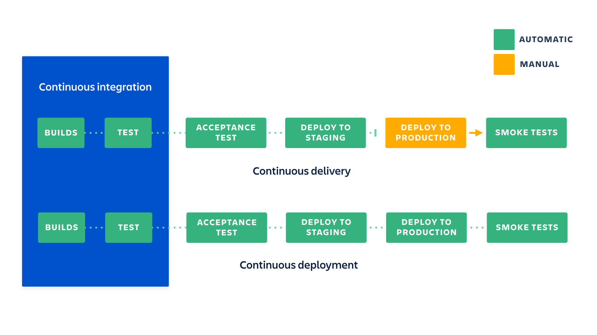
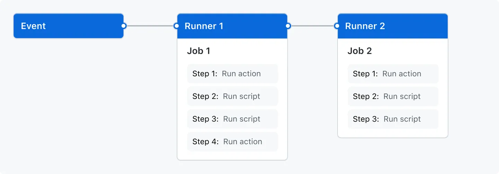

# Особенности деплоя и сборки SPA (CI/CD, Vercel, Netlify)

<!-- s -->

## Цели занятия

Освоить сборку и деплой фронтенда.

<!-- v -->

## К концу занятия вы сможете

- Понимать и использовать общие концепции CI/CD
- Настраивать деплой приложений на основе GitHub Actions
- Опубликовать приложение на собственный VPS с помощью GitHub Actions

<!-- s -->

## Краткое содержание

- CI/CD
- Vercel
- Netlify

<!-- s -->

## Результат занятия

Развёрнутое SPA-приложение, задеплоенное на Vercel или Netlify, с применением базовой CI/CD-практики

<!-- s -->

## Компетенции по занятию

- Использовать CI/CD
- Использование современного инструментария для JS

<!-- s -->

## Маршрут вебинара

- Deploy
- Continuous Integration
- Continuous Delivery
- Continuous Deployment
- GitHub Actions
- GitHub Actions Live
- Рефлексия

<!-- s -->

## Deploy

### Пример шагов

1. Компиляция приложения (build, auto test, report)
2. Выгрузка кода (бинарников) на сервер
3. Установка зависимостей проекта (например, package.json)
4. Выполнение тестов
5. Публикация приложения, пакетов, образов



<!-- s -->

## Что относится к CI/CD/CD?

- 1. Компиляция приложения (build, auto test, report) — **Continuous Integration**
- 2. Выгрузка кода (бинарников) на сервер — **Continuous Delivery**
- 3. Установка зависимостей проекта — **Continuous Delivery**
- 4. Выполнение тестов — **Continuous Delivery**
- 5. Публикация приложения/пакетов/образов — **Continuous Deployment**


<!-- s -->

## Continuous Integration vs Continuous Delivery vs Continuous Deployment

<!-- v -->

## Continuous Integration

Непрерывная интеграция

Разработчики часто вливают изменения в целевую ветку. Каждое изменение:

- Сборка проекта
- Автоматический запуск тестов
- Отчёты об успешности/неуспешности сборки

Преимущества:

- Меньше багов в рабочую среду
- Раннее выявление проблем интеграции
- Реже переключение контекста
- Снижение затрат на тестирование

Требования:

- Автотесты
- CI‑сервер/платформа
- Частые merge в целевую ветку


<!-- v -->

## Continuous Delivery

Непрерывная поставка

Продолжение CI: автоматизирован не только тестовый цикл, но и выпуск артефактов. Приложение можно развернуть в любое время по кнопке.

Важно: ранний деплой малых изменений, чтобы проще локализовать ошибки.

Преимущества:

- Простая поставка ПО
- Частые релизы и обратная связь
- Быстрые мелкие изменения ускоряют цикл разработки

Требования:

- Достаточное покрытие автотестами
- Сервер/сервис поставки сборок
- Понимание и применение feature flags


<!-- v -->

## Continuous Deployment

Непрерывное развертывание

Каждое изменение, прошедшее конвейер, автоматически попадает к пользователям. Остановить может только провал тестов.

Преимущества:

- Ускорение разработки
- Снижение рисков за счёт мелких инкрементов
- Постоянный поток улучшений для клиента

Требования:

- Сильная культура тестирования
- Документирование изменений вместе с релизом
- Активное использование feature flags


<!-- s -->

## Популярные решения

- GitHub Actions
- GitLab CI
- Jenkins
- TeamCity
- Travis CI
- Bitbucket Pipelines


> Примечание: Travis CI постепенно теряет популярность в open source, а GitHub Actions стал де‑факто стандартом для проектов на GitHub.

<!-- s -->

## GitHub Actions — основы

Настраиваемый автоматизированный процесс (workflow), который запускает одно или несколько заданий (jobs). Описывается YAML‑файлами в `.github/workflows`.

- Триггеры: события репозитория, ручной запуск, расписание
- Несколько workflows в репозитории, каждый со своим набором задач


<!-- v -->

## GitHub Actions — Workflow

- Набор jobs и шагов
- Определён в YAML
- Примерные сценарии: build, test, deploy



<!-- v -->

## GitHub Actions — Events

События, которые запускают workflow: PR, push, release, расписание, ручной запуск и др.

<!-- v -->

## GitHub Actions — Jobs

Набор шагов, выполняющихся на одном runner, по порядку с обменом данными между шагами.

<!-- v -->

## GitHub Actions — Actions

Переиспользуемые шаги из Marketplace или свои: checkout, setup‑node, login к облаку и т. д.

<!-- v -->

## GitHub Actions — Runner

Сервер‑агент, который исполняет jobs. Бывает облачный (GitHub‑hosted) и self‑hosted.

<!-- s -->

## Live: пример пайплайна

- Для примеров используется Node.js 20 LTS и npm 10 (или pnpm/yarn по выбору).
- Репозиторий: пример учебного деплоя
- Шаги: build → test → deploy
- Где смотреть логи и артефакты

<!-- s -->

## VPS: настройка окружения (пример)

- Купить недорогой VPS (например, Jino) и получить домен
- Установить OS (Ubuntu 24.04 LTS — рекомендуется)
- Узнать ssh‑порт (может отличаться от 22)
- Использовать веб‑терминал панели


<!-- s -->

## Docker: установка (Ubuntu)

- Следовать официальной инструкции: https://docs.docker.com/engine/install/ubuntu/
- Выполнить post‑install шаги: https://docs.docker.com/engine/install/linux-postinstall/

<!-- s -->

## Пользователь для деплоя (пример)

```bash
useradd -m deploy
passwd deploy
usermod -aG docker deploy
chsh -s /bin/bash deploy
```

<!-- s -->

## Self‑hosted Runner (пример)

- Создать self‑hosted runner в GitHub (Linux)
- Скачать и сконфигурировать агент на VPS
- Проверить статус в настройках репозитория

<!-- s -->

## GitHub Workflow: деплой

- Создать `.github/workflows/deploy.yml`
- Описать шаги деплоя: checkout → setup‑node → build → публикация
- Настроить секреты/переменные окружения

<!-- s -->

## Пример deploy.yml

```yaml
name: Deploy
on:
  push:
    branches: [main]
jobs:
  build-and-deploy:
    runs-on: ubuntu-latest
    steps:
      - uses: actions/checkout@v4
      - uses: actions/setup-node@v4
        with:
          node-version: "20"
      - run: npm ci && npm run build
      - name: Deploy to VPS
        run: |
          rsync -avz ./dist/ user@server:/var/www/app
```

<!-- s -->

## Vercel и Netlify (SPA)

- Подключение репозитория
- Автобилд на push в main
- Настройка build команд и output директории
- Переменные окружения
- Предпросмотры PR

> Для SPA необходимо настроить fallback на `index.html` (в Vercel и Netlify это обычно делается автоматически, но можно задать явно в Redirects/Rewrite).

- PR Preview: каждая ветка автоматически получает отдельный URL для тестирования.

<!-- s -->

## Домашнее задание

Подробности и критерии смотрите на учебном портале.

<!-- s -->

## Q&A

Вопросы по CI/CD, деплою на Vercel/Netlify и GitHub Actions?

- Разбор типичных ошибок пайплайнов
- Настройка переменных окружения
- Особенности SPA‑деплоя (SPA fallback, 404 → index.html)
