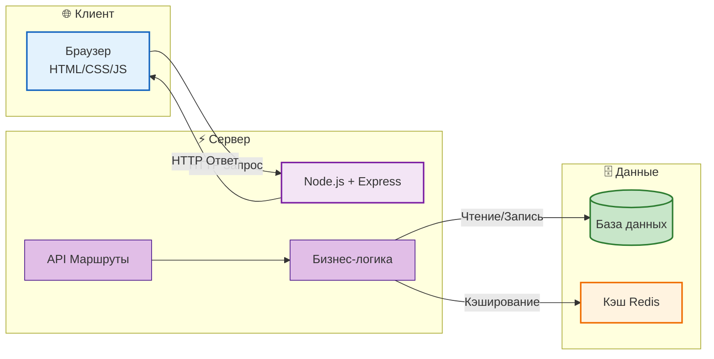
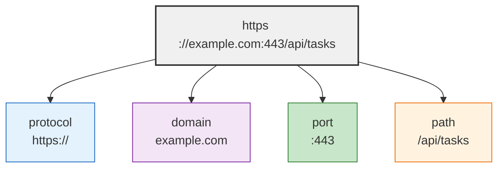
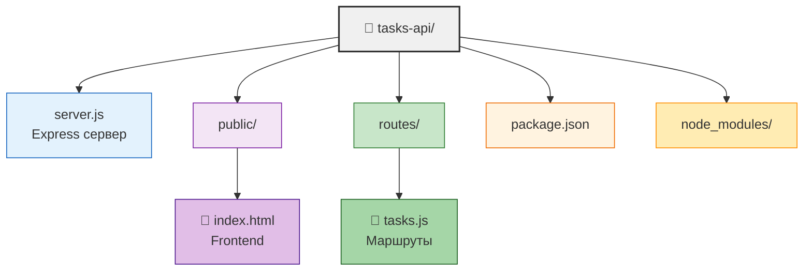

# REST, RPC и сетевые запросы

## Архитектура API и работа с сетью

<!-- v -->

## Как меня слышно и видно?

> Напишите в чат

- **+** если все хорошо
- **–** если есть проблемы со звуком или с видео

<!-- v -->

## Цели занятия

- Понять архитектуру клиент-сервер
- Освоить принципы REST API
- Научиться создавать REST API на Node.js + Express
- Работать с сетевыми запросами: Fetch API и Axios
- Разобраться с CORS и обработкой ошибок

<!-- v -->

## Краткое содержание

1. Клиент-сервер архитектура и HTTP
2. REST: принципы и CRUD операции
3. Node.js + Express: создание REST API
4. Fetch API для работы с сервером
5. Axios как альтернатива Fetch
6. CORS и обработка ошибок

<!-- v -->

## Результат занятия

Рабочий REST API с CRUD-операциями для задач (tasks) на Node.js + клиент на Fetch API

<!-- v -->

## Компетенции по занятию

- **Понимать архитектуру REST API**
- **Создавать CRUD операции на Node.js**
- **Использовать Fetch API и axios**
- Обрабатывать ошибки сетевых запросов
- Работать с CORS

<!-- s -->

# Клиент-сервер и HTTP

<!-- v -->

## Клиент-сервер архитектура



**Клиент** — отправляет запросы (браузер, мобильное приложение)  
**Сервер** — обрабатывает запросы и возвращает данные

<!-- v -->

## HTTP протокол

**HTTP** (HyperText Transfer Protocol) — протокол передачи данных

### Структура HTTP запроса:

```http
GET /api/tasks HTTP/1.1
Host: localhost:3000
Content-Type: application/json
Authorization: Bearer token123
```

### Структура HTTP ответа:

```http
HTTP/1.1 200 OK
Content-Type: application/json

{ "id": 1, "title": "Task 1" }
```

<!-- v -->

## HTTP Методы REST API

| Метод      | Назначение           | Пример                |
| ---------- | -------------------- | --------------------- |
| **GET**    | Получить данные      | `GET /api/tasks`      |
| **POST**   | Создать новую запись | `POST /api/tasks`     |
| **PUT**    | Заменить полностью   | `PUT /api/tasks/1`    |
| **PATCH**  | Обновить частично    | `PATCH /api/tasks/1`  |
| **DELETE** | Удалить              | `DELETE /api/tasks/1` |

**Idempotent методы** (можно повторять): GET, PUT, PATCH, DELETE  
**Non-idempotent**: POST (каждый вызов создает новую запись)

<!-- v -->

## HTTP статус-коды

|   Код   | Название              | Описание                             |
| :-----: | :-------------------- | :----------------------------------- |
| **200** | OK                    | Успешный запрос (GET, PUT, PATCH)    |
| **201** | Created               | Ресурс создан (POST)                 |
| **204** | No Content            | Успешно, но без содержимого (DELETE) |
| **400** | Bad Request           | Ошибка в запросе                     |
| **401** | Unauthorized          | Требуется авторизация                |
| **403** | Forbidden             | Доступ запрещён                      |
| **404** | Not Found             | Ресурс не найден                     |
| **500** | Internal Server Error | Ошибка сервера                       |

<!-- v -->

## JSON — формат обмена данными

```json
{
  "id": 1,
  "title": "Купить молоко",
  "completed": false,
  "createdAt": "2024-01-15T10:30:00Z"
}
```

**Преимущества JSON:**

- Читаемый для человека
- Легко парсится в JavaScript
- Поддержка массивов и вложенных объектов
- Стандарт для REST API

<!-- s -->

# REST: Архитектура

<!-- v -->

## Что такое REST?

**REST** (Representational State Transfer) — архитектурный стиль, а не протокол

**Ключевая идея:** веб-сервис как набор ресурсов с унифицированным интерфейсом

```
Ресурс: /api/users/123
Представление: { "id": 123, "name": "John" }
```

<!-- v -->

## Stateless — без состояния

**Каждый запрос содержит всю информацию для обработки:**

```http
GET /api/tasks HTTP/1.1
Authorization: Bearer eyJhbGc...
```

Сервер не хранит информацию о сессии клиента между запросами.

<!-- v -->

### 2. **Uniform Interface** (единый интерфейс)

Все ресурсы доступны через стандартные HTTP методы:

```
GET    /api/tasks      → Получить список
GET    /api/tasks/1    → Получить одну задачу
POST   /api/tasks      → Создать новую
PATCH  /api/tasks/1    → Обновить
DELETE /api/tasks/1    → Удалить
```

<!-- v -->

### 3. **Ресурсы и их представления**

**Ресурс** — сущность (задача, пользователь, статья)  
**URI** — идентификатор ресурса (`/api/tasks/1`)  
**Представление** — формат данных (обычно JSON)

```javascript
// Один и тот же ресурс, разные представления
GET /api/tasks/1
Accept: application/json  → { "id": 1, "title": "Task" }

GET /api/tasks/1
Accept: application/xml   → 1...
```

<!-- v -->

## CRUD → HTTP методы

**CRUD** — Create, Read, Update, Delete

| CRUD   | HTTP Method | Endpoint         | Тело запроса | Ответ      |
| ------ | ----------- | ---------------- | ------------ | ---------- |
| Create | POST        | `/api/tasks`     | `{ title }`  | 201 + JSON |
| Read   | GET         | `/api/tasks`     | —            | 200 + JSON |
| Read   | GET         | `/api/tasks/:id` | —            | 200 + JSON |
| Update | PATCH/PUT   | `/api/tasks/:id` | `{ title }`  | 200 + JSON |
| Delete | DELETE      | `/api/tasks/:id` | —            | 204        |

<!-- v -->

## REST vs RPC

|   Аспект   | **REST**                                    | **RPC**                            |
| :--------: | :------------------------------------------ | :--------------------------------- |
| **Подход** | Работа с ресурсами                          | Вызов действий                     |
|  **URL**   | `/ресурсы/{id}`<br>`/api/tasks/123`         | `/api`                             |
| **Методы** | GET, POST, PUT, DELETE                      | POST                               |
| **Пример** | `GET /api/tasks`<br>`DELETE /api/users/123` | `POST /api {"method": "getTasks"}` |
| **Когда**  | Публичные API, CRUD операции                | Сложные операции, микросервисы     |

<!-- v -->

# RPC: Удалённый вызов процедур

<!-- v -->

## Что такое RPC?

**RPC** (Remote Procedure Call) — вызов функции на удалённом сервере

```javascript
// Локальный вызов
const result = calculator.add(2, 3);

// RPC — выполняется на сервере
const result = await remoteCalculator.add(2, 3);
```

**Фокус:** действия (процедуры), а не ресурсы

<!-- v -->

## JSON-RPC 2.0

**Запрос:**

```json
{
  "jsonrpc": "2.0",
  "method": "user.create",
  "params": { "name": "John" },
  "id": 1
}
```

**Ответ:**

```json
{
  "jsonrpc": "2.0",
  "result": { "id": 123, "name": "John" },
  "id": 1
}
```

<!-- v -->

## gRPC

**От Google, использует Protocol Buffers:**

- Бинарный формат (быстрее JSON)
- Строгая типизация
- Streaming

**Использование:** микросервисы, мобильные приложения

<!-- v -->

## Когда что использовать?

**REST:** публичные API, CRUD-операции, браузерные приложения

**RPC:** сложные операции, микросервисы, batch-операции

<!-- v -->

## Гибридный подход

**На практике комбинируют REST + action endpoints:**

```
REST для ресурсов:
GET  /api/users/123
POST /api/users

Action endpoints для операций вне CRUD:
POST /api/users/123/send-verification-email
POST /api/orders/123/cancel
```

<!-- s -->

# Fetch API

<!-- v -->

## GET-запрос

```javascript
const response = await fetch("/api/users");
const users = await response.json();
```

<!-- v -->

## POST-запрос

```javascript
const response = await fetch("/api/users", {
  method: "POST",
  headers: { "Content-Type": "application/json" },
  body: JSON.stringify({ name: "John", email: "john@example.com" }),
});

const newUser = await response.json();
```

<!-- v -->

## Fetch: Важная особенность ❗

**Fetch не выбрасывает ошибку при 4xx/5xx:**

```javascript
// ❌ Плохо — 404 не поймается в catch
try {
  const response = await fetch("/api/users/999");
  const user = await response.json();
} catch (error) {
  // Сюда попадут только сетевые ошибки!
}

// ✅ Хорошо — проверяем response.ok
const response = await fetch("/api/users/999");
if (!response.ok) {
  throw new Error(`HTTP ${response.status}`);
}
const user = await response.json();
```

<!-- v -->

## Fetch: Отмена запроса

```javascript
const controller = new AbortController();
setTimeout(() => controller.abort(), 5000);

try {
  const response = await fetch("/api/data", {
    signal: controller.signal,
  });
} catch (error) {
  if (error.name === "AbortError") {
    console.log("Запрос отменён");
  }
}
```

<!-- s -->

# Axios

<!-- v -->

## Почему Axios?

- Автоматический JSON
- Выбрасывает ошибки при 4xx/5xx
- Интерцепторы
- Таймаут из коробки

```bash
npm install axios
```

<!-- v -->

## Axios: Базовые запросы

```javascript
import axios from "axios";

const { data: users } = await axios.get("/api/users");
const { data: newUser } = await axios.post("/api/users", { name: "John" });
await axios.patch("/api/users/123", { name: "Jane" });
await axios.delete("/api/users/123");
```

<!-- v -->

## Axios: Создание экземпляра

```javascript
import axios from "axios";

export const api = axios.create({
  baseURL: "https://api.example.com",
  timeout: 10000,
});

// Интерцептор для токена
api.interceptors.request.use((config) => {
  const token = localStorage.getItem("token");
  if (token) config.headers.Authorization = `Bearer ${token}`;
  return config;
});
```

<!-- v -->

## Axios: Отмена запроса

```javascript
const controller = new AbortController();

api.get("/users", { signal: controller.signal });

// Отмена
controller.abort();
```

<!-- v -->

## Fetch vs Axios

| Аспект           | Fetch            | Axios         |
| ---------------- | ---------------- | ------------- |
| **Встроенный**   | ✅ Да            | ❌ Установка  |
| **JSON**         | Ручной `.json()` | Автоматически |
| **Ошибки HTTP**  | Не выбрасывает   | Выбрасывает   |
| **Интерцепторы** | ❌ Нет           | ✅ Есть       |
| **Размер**       | 0 KB             | ~13 KB        |

<!-- s -->

# Обработка ошибок

<!-- v -->

## Обёртка для Fetch

```javascript
async function fetchJSON(url, options = {}) {
  const method = options.method || "GET";
  const hasBody =
    !["GET", "HEAD"].includes(method.toUpperCase()) && options.body;

  const response = await fetch(url, {
    ...options,
    headers: {
      Accept: "application/json",
      ...(hasBody && { "Content-Type": "application/json" }),
      ...options.headers,
    },
    body: hasBody ? JSON.stringify(options.body) : undefined,
  });

  if (!response.ok) {
    const error = await response.json().catch(() => ({}));
    throw new Error(error.message || `HTTP ${response.status}`);
  }

  return response.status === 204 ? null : response.json();
}
```

<!-- s -->

# CORS

<!-- v -->

## Same-Origin Policy

**Браузер блокирует запросы к другим доменам:**

```javascript
// Страница: https://myapp.com

fetch("https://myapp.com/api/tasks"); // ✅ OK (same origin)
fetch("http://localhost:3000/api"); // ❌ Blocked (другой порт)
fetch("https://api.example.com"); // ❌ Blocked (другой домен)
```

<!-- v -->

**Origin** = протокол + домен + порт



<!-- v -->

## Что такое CORS?

**CORS** (Cross-Origin Resource Sharing) — механизм, позволяющий серверу разрешить запросы с других доменов

**Сервер отправляет заголовки:**

```http
Access-Control-Allow-Origin: https://myapp.com
Access-Control-Allow-Methods: GET, POST, PUT, DELETE
Access-Control-Allow-Headers: Content-Type, Authorization
```

<!-- v -->

**Без CORS:**

```
Browser → Server: Can I make request from https://myapp.com?
Server → Browser: (no CORS headers)
Browser: ❌ Blocked by CORS policy
```

**С CORS:**

```
Server → Browser: Access-Control-Allow-Origin: https://myapp.com
Browser: ✅ Request allowed
```

<!-- v -->

## CORS на сервере (Express)

```javascript
const express = require("express");
const cors = require("cors");

const app = express();

// Вариант 1: Разрешить все (только для разработки!)
app.use(cors());

// Вариант 2: Конкретные origins (production)
app.use(
  cors({
    origin: ["https://myapp.com", "https://admin.myapp.com"],
    methods: ["GET", "POST", "PATCH", "DELETE"],
    credentials: true, // Для cookie
  })
);
```

<!-- v -->

**Важно:** при `credentials: true` origin должен быть конкретным (не `*`), и на клиенте нужен `credentials: "include"` в fetch

<!-- v -->

## Preflight запросы

**Для сложных запросов браузер сначала отправляет OPTIONS:**

```
Client → Server: OPTIONS /api/tasks
                 (проверить разрешения)

Server → Client: Access-Control-Allow-Origin: ...
                 Access-Control-Allow-Methods: ...

Client → Server: POST /api/tasks
                 (основной запрос)
```

<!-- v -->

**Сложные запросы:**

- Методы кроме GET/POST/HEAD
- Заголовки кроме стандартных
- Content-Type кроме form/text/plain

**Express + CORS** автоматически обрабатывает preflight

<!-- s -->

## Практические советы

<!-- v -->

## Структура проекта



<!-- v -->

**Вынос маршрутов в отдельный файл:**

```javascript
// routes/tasks.js
const express = require('express');
const router = express.Router();

let tasks = [...];

router.get('/', (req, res) => res.json(tasks));
router.post('/', (req, res) => { /* ... */ });

module.exports = router;
```

```javascript
// server.js
const tasksRouter = require("./routes/tasks");
app.use("/api/tasks", tasksRouter);
```

<!-- v -->

## Валидация данных

```javascript
// Простая валидация
app.post("/api/tasks", (req, res) => {
  const { title } = req.body;

  // Проверка обязательных полей
  if (!title || typeof title !== "string") {
    return res.status(400).json({
      error: "Title is required and must be a string",
    });
  }

  // Проверка длины
  if (title.trim().length === 0) {
    return res.status(400).json({
      error: "Title cannot be empty",
    });
  }

  if (title.length > 200) {
    return res.status(400).json({
      error: "Title is too long (max 200 characters)",
    });
  }

  // Создание задачи...
});
```

<!-- v -->

## Логирование запросов

```javascript
// Простой логгер
app.use((req, res, next) => {
  console.log(`${new Date().toISOString()} ${req.method} ${req.path}`);
  next();
});

// Или использовать morgan
const morgan = require("morgan");
app.use(morgan("dev"));
```

**Вывод:**

```
2024-02-09T10:30:45.123Z GET /api/tasks
2024-02-09T10:30:47.456Z POST /api/tasks
```

<!-- v -->

## Обработка глобальных ошибок

```javascript
// Обработчик ошибок (в конце всех маршрутов)
app.use((err, req, res, next) => {
  console.error(err.stack);

  res.status(err.status || 500).json({
    error: err.message || "Internal Server Error",
  });
});

// Использование
app.get("/api/tasks/:id", (req, res, next) => {
  try {
    const task = findTask(req.params.id);
    if (!task) {
      const error = new Error("Task not found");
      error.status = 404;
      throw error;
    }
    res.json(task);
  } catch (error) {
    next(error); // Передаем в обработчик ошибок
  }
});
```

<!-- v -->

## Retry при ошибках

```javascript
async function fetchWithRetry(url, options = {}, retries = 3) {
  for (let i = 0; i < retries; i++) {
    try {
      const response = await fetch(url, options);
      // Ретрай только для 5xx; 4xx обрабатываем в вызывающем коде
      if (response.status >= 500) throw new Error("Server error");
      return response; // 2xx, 3xx, 4xx — возвращаем как есть
    } catch (error) {
      if (i === retries - 1) throw error;
      await new Promise((r) => setTimeout(r, 1000 * Math.pow(2, i)));
    }
  }
}
```

**Важно:** retry безопасен для idempotent-методов (GET, PUT, DELETE). Для 429/408 нужна отдельная логика (rate-limit)

<!-- s -->

# Node.js + Express REST API

<!-- v -->

## Настройка проекта

```bash
# Создаем папку проекта
mkdir tasks-api
cd tasks-api

# Инициализируем npm
npm init -y

# Устанавливаем Express
npm install express

# Опционально: для автоперезагрузки
npm install --save-dev nodemon
```

**package.json:**

```json
{
  "scripts": {
    "start": "node server.js",
    "dev": "nodemon server.js"
  }
}
```

<!-- v -->

## Простейший Express сервер

```javascript
// server.js
const express = require("express");

const app = express();
const PORT = 3000;

// Простой маршрут
app.get("/", (req, res) => {
  res.send("Hello from Express!");
});

app.listen(PORT, () => {
  console.log(`Server running on http://localhost:${PORT}`);
});
```

**Запуск:**

```bash
node server.js
# или
npm run dev
```

**Проверка:** Открыть `http://localhost:3000` в браузере

<!-- v -->

## In-Memory база данных

```javascript
// server.js
const express = require("express");
const app = express();

// Middleware для парсинга JSON
app.use(express.json());

// "База данных" — массив объектов
let tasks = [
  { id: 1, title: "Купить молоко", completed: false },
  { id: 2, title: "Выучить REST", completed: false },
];

// Счетчик для генерации ID
let nextId = 3;

const PORT = 3000;
app.listen(PORT, () => {
  console.log(`API on http://localhost:${PORT}`);
});
```

**Важно:** `app.use(express.json())` — без этого `req.body` будет `undefined`!

<!-- v -->

## GET /api/tasks — получить все

```javascript
// Получить все задачи
app.get("/api/tasks", (req, res) => {
  res.json(tasks);
});
```

**Тест в браузере:**

```
http://localhost:3000/api/tasks

Ответ:
[
  { "id": 1, "title": "Купить молоко", "completed": false },
  { "id": 2, "title": "Выучить REST", "completed": false }
]
```

<!-- v -->

## GET /api/tasks/:id — получить одну

```javascript
// Получить задачу по ID
app.get("/api/tasks/:id", (req, res) => {
  // req.params.id — параметр из URL
  const id = parseInt(req.params.id);

  // Ищем задачу
  const task = tasks.find((t) => t.id === id);

  // Если не нашли — 404
  if (!task) {
    return res.status(404).json({
      error: "Task not found",
    });
  }

  res.json(task);
});
```

**Тест:**

- `GET /api/tasks/1` → `{ "id": 1, "title": "Купить молоко", ... }`
- `GET /api/tasks/999` → `{ "error": "Task not found" }`

<!-- v -->

## POST /api/tasks — создать новую

```javascript
// Создать новую задачу
app.post("/api/tasks", (req, res) => {
  // Данные приходят в req.body
  const { title } = req.body;

  // Валидация
  if (!title || title.trim() === "") {
    return res.status(400).json({
      error: "Title is required",
    });
  }

  // Создаем задачу
  const newTask = {
    id: nextId++,
    title: title.trim(),
    completed: false,
  };

  tasks.push(newTask);

  // 201 Created
  res.status(201).json(newTask);
});
```

<!-- v -->

## Тестирование POST через Thunder Client

**Thunder Client** — расширение для VS Code

1. Установить расширение "Thunder Client"
2. Открыть панель Thunder Client
3. New Request → POST
4. URL: `http://localhost:3000/api/tasks`
5. Body → JSON:

```json
{
  "title": "Новая задача"
}
```

<!-- v -->

6. Send

**Ответ:**

```json
{
  "id": 3,
  "title": "Новая задача",
  "completed": false
}
```

<!-- v -->

## PATCH /api/tasks/:id — обновить

```javascript
// Обновить задачу
app.patch("/api/tasks/:id", (req, res) => {
  const id = parseInt(req.params.id);
  const task = tasks.find((t) => t.id === id);

  if (!task) {
    return res.status(404).json({ error: "Task not found" });
  }

  // Обновляем только переданные поля
  if (req.body.title !== undefined) {
    task.title = req.body.title;
  }
  if (req.body.completed !== undefined) {
    task.completed = req.body.completed;
  }

  res.json(task);
});
```

<!-- v -->

**Пример запроса:**

```
PATCH /api/tasks/1
Body: { "completed": true }
```

<!-- v -->

## DELETE /api/tasks/:id — удалить

```javascript
// Удалить задачу
app.delete("/api/tasks/:id", (req, res) => {
  const id = parseInt(req.params.id);
  const index = tasks.findIndex((t) => t.id === id);

  if (index === -1) {
    return res.status(404).json({ error: "Task not found" });
  }

  // Удаляем из массива
  tasks.splice(index, 1);

  // 204 No Content — успех без тела ответа
  res.status(204).send();
});
```

**Тест:**

```
DELETE /api/tasks/1
Ответ: 204 No Content (пустое тело)
```

<!-- s -->

## Домашнее задание

Полное описание в учебном портале и в ветке урока task

<!-- s -->

## Итоги занятия

- Архитектурные принципы REST (6 constraints)
- REST vs RPC — когда что использовать
- Fetch API и Axios
- Обработка ошибок
- CORS

<!-- s -->

## Q&A

**Вопросы?**

- Когда выбирать REST, а когда RPC?
- Fetch vs Axios?
- Как работает CORS?
